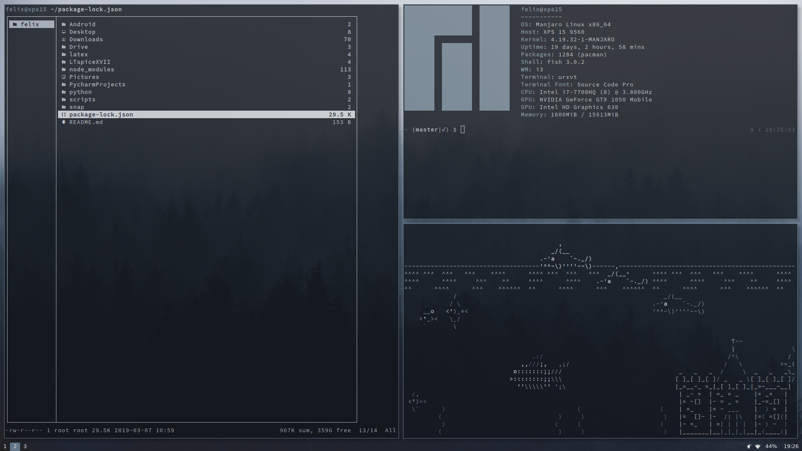

# my dotfiles

Configs for
- i3 (window manager)
- compton (compositor)
- Xresources
- fish
- ranger (file manager)
- polybar
- rofi (application launcher)
- vim
- GIMP

## Wallpaper

https://unsplash.com/photos/KT3WlrL_bsg

## Screenshots

