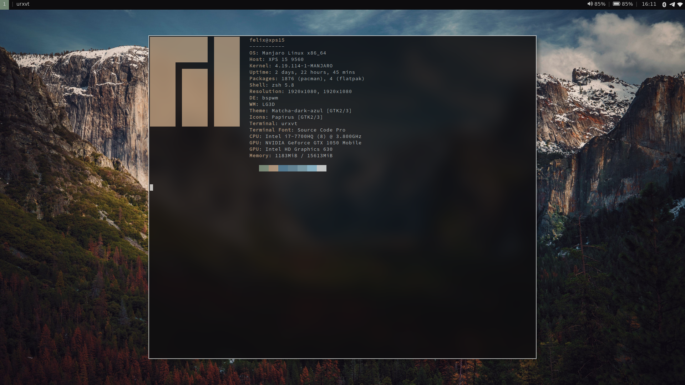

## Screenshots

---

## Configs for
- i3 (window manager)
- compton (compositor)
- Xresources
- zsh
- ranger (file manager)
- polybar (status bar) 
- rofi (application launcher)
- vim
- spacemacs
- GIMP
- some other configs and small scripts 
