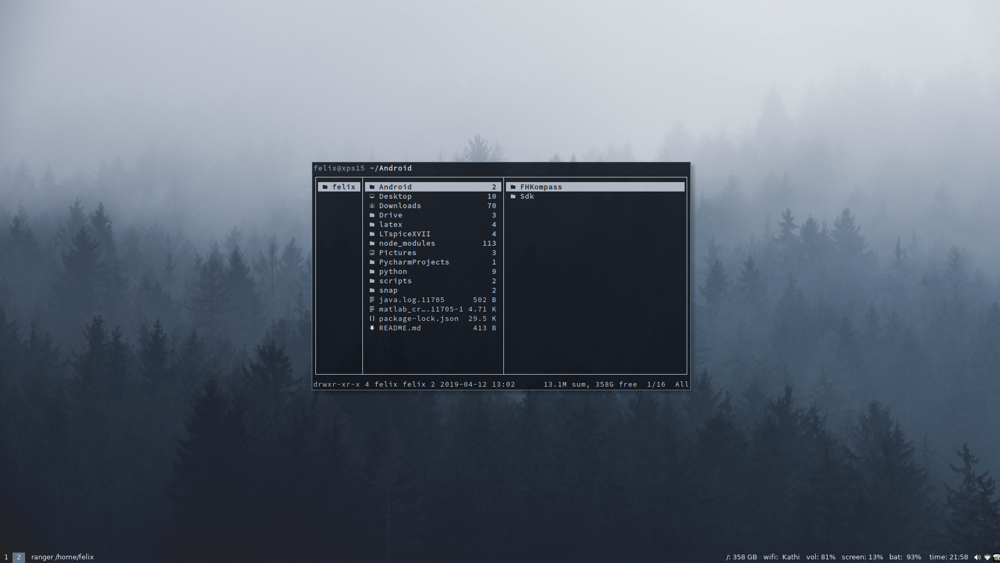

# my dotfiles

Configs for
- i3 (window manager)
- compton (compositor)
- Xresources
- fish (shell) 
- ranger (file manager)
- polybar (status bar) 
- rofi (application launcher)
- vim
- GIMP
- some other configs and small scripts 

## Wallpaper

https://unsplash.com/photos/KT3WlrL_bsg

## Screenshots

